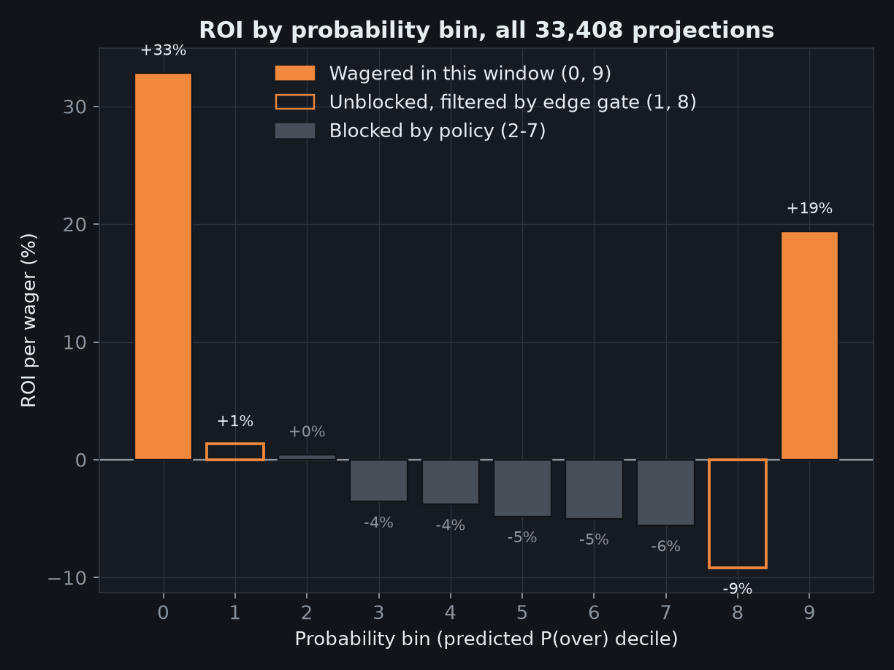
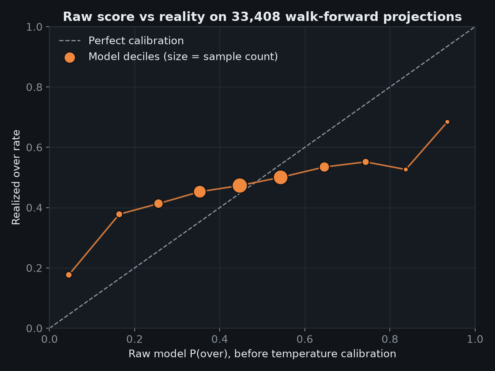
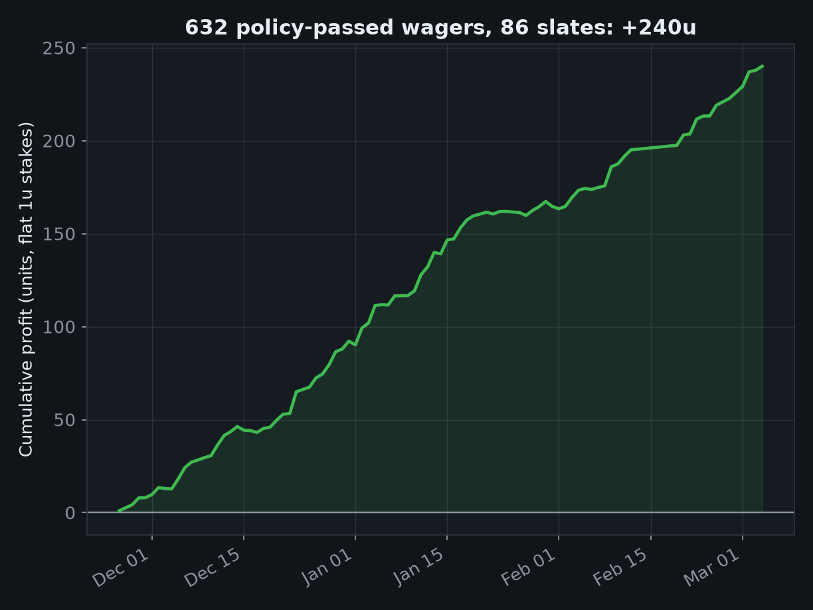
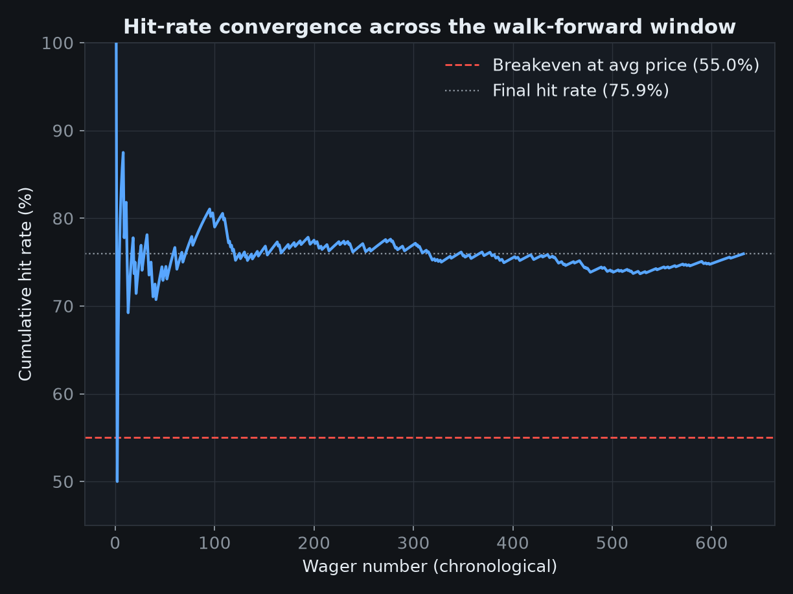
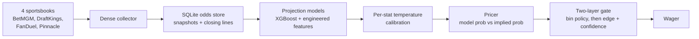

  

<h1 align="center">Courtside</h1>

An NBA player prop forecasting engine I built and ran across the 2025-26 season. The source is private. This repo holds the methodology and the validated results.

---

## What it does

Courtside projects the distribution of a player's stat line for every game on the slate. It prices each sportsbook line against that distribution and only surfaces a wager when the edge survives two layers of gating. It also collects its own market data. A dense collector snapshots BetMGM, DraftKings, FanDuel and Pinnacle all day and archives the closing line for every prop it saw, which is what makes honest backtesting possible later.

## The numbers

| Metric | Value |
|---|---|
| Odds snapshots collected | 9.1M+ across the 2025-26 season |
| Closing lines archived | 877K+ |
| Walk-forward window | Nov 26, 2025 to Mar 4, 2026 (91 slates scored) |
| Scored projections | 33,408 across 405 players |
| Policy-passed wagers | 632 (322 points, 310 assists), every one priced at a real closing line |
| Hit rate | 75.9% against a 55.0% breakeven at the average price |
| Profit | +240 units at flat 1u stakes, +38% ROI |

Each projection is scored walk-forward. The model only ever trains on games played before the day it's projecting, and the charts below are generated straight from that backtest artifact.

## Where the edge lives

ROI per wager across all 33,408 scored projections, split by the model's raw P(over) decile. The middle bins are dead money and the policy blocks them outright. Bins 1 and 8 are open in principle, but the per-wager edge gate filtered every candidate there in this window. All 632 wagers came from bins 0 and 9.

## Raw scores get calibrated before anything is priced

The raw model is directionally right but overconfident in the tails. That's why raw scores pass through temperature calibration, fitted separately for each stat, before any edge is computed.

## Cumulative profit

The 632 policy-passed wagers in chronological order at flat 1u stakes and real closing prices. They landed on 86 of the 91 scored slates.

## Hit-rate convergence

The cumulative hit rate settles near 76% once the early-sample noise washes out. Breakeven at the average price taken is 55%.

## How it works

The collector runs all day during the season. Prices are de-vigged with Pinnacle as the sharp reference book, and every prop's closing line is archived so backtests settle against what the market actually closed at, not a synthetic line.

The projection layer is Python: pandas and NumPy for features, XGBoost for the models, scikit-learn for evaluation. Everything persists in SQLite with WAL mode so the collector and the pricer can run at the same time.

The gate is deliberately paranoid. A probability bin has to be profitable historically or it's blocked outright, and a wager inside an open bin still has to clear per-wager thresholds on edge and confidence. The current policy also whitelists points and assists only. Most nights that means a handful of wagers, and some nights none.

## Why the source is private

The scraper implementations, gate thresholds, bin definitions and calibration parameters are the edge, and publishing them would burn it. I'm happy to walk through the design and the code in an interview.

## Contact

Ronil Basu, Rutgers University-New Brunswick, BS Data Science

[linkedin.com/in/ronil-basu](https://linkedin.com/in/ronil-basu) · ronilbasu@gmail.com
